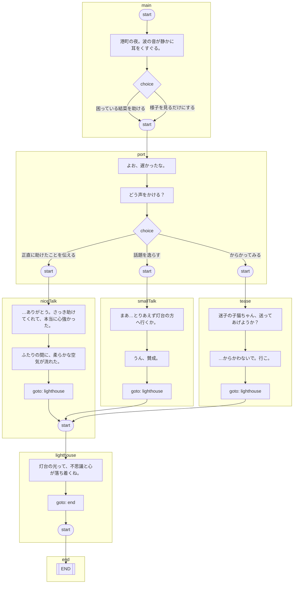

```mermaid
flowchart TD
  subgraph main[main]
    main_start([start])
    main_2_say[港町の夜。波の音が静かに耳をくすぐる。]
    main_start --> main_2_say
    main_4_choice{choice}
    main_2_say --> main_4_choice
    main_4_choice -- "困っている結菜を助ける" --> port_start
    main_4_choice -- "様子を見るだけにする" --> port_start
  end
  subgraph port[port]
    port_start([start])
    port_0_say[よお、遅かったな。]
    port_start --> port_0_say
    port_1_say[どう声をかける？]
    port_0_say --> port_1_say
    port_2_choice{choice}
    port_1_say --> port_2_choice
    port_2_choice -- "正直に助けたことを伝える" --> niceTalk_start
    port_2_choice -- "話題を逸らす" --> smallTalk_start
    port_2_choice -- "からかってみる" --> tease_start
  end
  subgraph niceTalk[niceTalk]
    niceTalk_start([start])
    niceTalk_0_say[…ありがとう。さっき助けてくれて、本当に心強かった。]
    niceTalk_start --> niceTalk_0_say
    niceTalk_1_say[ふたりの間に、柔らかな空気が流れた。]
    niceTalk_0_say --> niceTalk_1_say
    niceTalk_2_goto[goto: lighthouse]
    niceTalk_1_say --> niceTalk_2_goto
    niceTalk_2_goto --> lighthouse_start
  end
  subgraph smallTalk[smallTalk]
    smallTalk_start([start])
    smallTalk_0_say[まあ…とりあえず灯台の方へ行くか。]
    smallTalk_start --> smallTalk_0_say
    smallTalk_1_say[うん、賛成。]
    smallTalk_0_say --> smallTalk_1_say
    smallTalk_2_goto[goto: lighthouse]
    smallTalk_1_say --> smallTalk_2_goto
    smallTalk_2_goto --> lighthouse_start
  end
  subgraph tease[tease]
    tease_start([start])
    tease_0_say[迷子の子猫ちゃん、送ってあげようか？]
    tease_start --> tease_0_say
    tease_1_say[…からかわないで。行こ。]
    tease_0_say --> tease_1_say
    tease_2_goto[goto: lighthouse]
    tease_1_say --> tease_2_goto
    tease_2_goto --> lighthouse_start
  end
  subgraph lighthouse[lighthouse]
    lighthouse_start([start])
    lighthouse_2_say[灯台の光って、不思議と心が落ち着くね。]
    lighthouse_start --> lighthouse_2_say
    lighthouse_3_goto[goto: end]
    lighthouse_2_say --> lighthouse_3_goto
    lighthouse_3_goto --> end_start
  end
  subgraph end[end]
    end_start([start])
    end_2_say[[END]]
    end_start --> end_2_say
  end
```