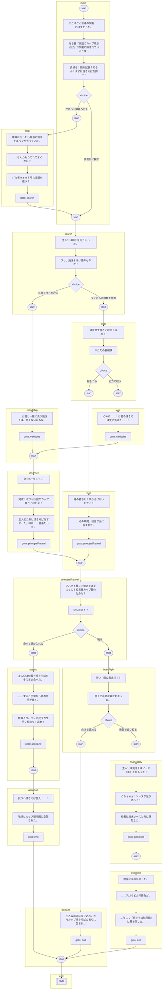

```mermaid
flowchart TD
  subgraph main[main]
    main_start([start])
    main_2_say[ここはごく普通の学園……のはずだった。]
    main_start --> main_2_say
    main_3_say[ある日『伝説のカップ焼きそば』が学園に隠されていると噂…]
    main_2_say --> main_3_say
    main_5_say[貴様ら！期末試験？知らん！まずは焼きそばを探せ！]
    main_3_say --> main_5_say
    main_6_choice{choice}
    main_5_say --> main_6_choice
    main_6_choice -- "真面目に探す" --> search_start
    main_6_choice -- "サボって購買へ行く" --> skip_start
  end
  subgraph search[search]
    search_start([start])
    search_0_say[主人公は廊下を走り回った。]
    search_start --> search_0_say
    search_1_say[フッ、焼きそばは俺のものだ！]
    search_0_say --> search_1_say
    search_2_choice{choice}
    search_1_say --> search_2_choice
    search_2_choice -- "ライバルに勝負を挑む" --> duel_start
    search_2_choice -- "共闘を持ちかける" --> friendship_start
  end
  subgraph skip[skip]
    skip_start([start])
    skip_0_say[購買に行ったら普通に焼きそばパンが売っていた。]
    skip_start --> skip_0_say
    skip_1_say[……なんかもうこれでよくない？]
    skip_0_say --> skip_1_say
    skip_2_say[バカ者ォォォ！それは麺が違う！！]
    skip_1_say --> skip_2_say
    skip_3_goto[goto: search]
    skip_2_say --> skip_3_goto
    skip_3_goto --> search_start
  end
  subgraph duel[duel]
    duel_start([start])
    duel_1_say[体育館で焼きそばバトルだ！]
    duel_start --> duel_1_say
    duel_2_say[※ただの腕相撲]
    duel_1_say --> duel_2_say
    duel_3_choice{choice}
    duel_2_say --> duel_3_choice
    duel_3_choice -- "全力で戦う" --> win_start
    duel_3_choice -- "指をつる" --> lose_start
  end
  subgraph friendship[friendship]
    friendship_start([start])
    friendship_0_say[……お前と一緒に食う焼きそば、悪くないかもな。]
    friendship_start --> friendship_0_say
    friendship_1_goto[goto: yakisoba]
    friendship_0_say --> friendship_1_goto
    friendship_1_goto --> yakisoba_start
  end
  subgraph win[win]
    win_start([start])
    win_0_say[ぐぬぬ……！お前の焼きそば愛に負けた……！]
    win_start --> win_0_say
    win_1_goto[goto: yakisoba]
    win_0_say --> win_1_goto
    win_1_goto --> yakisoba_start
  end
  subgraph lose[lose]
    lose_start([start])
    lose_0_say[俺の勝ちだ！焼きそばはいただく！]
    lose_start --> lose_0_say
    lose_1_say[……その瞬間、校舎が光に包まれた。]
    lose_0_say --> lose_1_say
    lose_2_goto[goto: principalReveal]
    lose_1_say --> lose_2_goto
    lose_2_goto --> principalReveal_start
  end
  subgraph yakisoba[yakisoba]
    yakisoba_start([start])
    yakisoba_2_say[（ﾁｮｯﾄﾏｯﾃﾈ 3ﾌﾝ…）]
    yakisoba_start --> yakisoba_2_say
    yakisoba_4_say[完成！ボクが伝説のカップ焼きそばだよ！]
    yakisoba_2_say --> yakisoba_4_say
    yakisoba_5_say[主人公たちは焼きそばをすすった。味は……普通だった。]
    yakisoba_4_say --> yakisoba_5_say
    yakisoba_6_goto[goto: principalReveal]
    yakisoba_5_say --> yakisoba_6_goto
    yakisoba_6_goto --> principalReveal_start
  end
  subgraph principalReveal[principalReveal]
    principalReveal_start([start])
    principalReveal_2_say[フハハ！我こそ焼きそばそのもの！校長兼カップ麺の化身だ！]
    principalReveal_start --> principalReveal_2_say
    principalReveal_3_say[なんだと！？]
    principalReveal_2_say --> principalReveal_3_say
    principalReveal_4_choice{choice}
    principalReveal_3_say --> principalReveal_4_choice
    principalReveal_4_choice -- "戦う" --> bossFight_start
    principalReveal_4_choice -- "食べて受け入れる" --> absorb_start
  end
  subgraph bossFight[bossFight]
    bossFight_start([start])
    bossFight_1_say[来い！麺の裁きだ！！]
    bossFight_start --> bossFight_1_say
    bossFight_2_say[屋上で最終決戦が始まった。]
    bossFight_1_say --> bossFight_2_say
    bossFight_3_choice{choice}
    bossFight_2_say --> bossFight_3_choice
    bossFight_3_choice -- "勇気を振り絞る" --> finalVictory_start
    bossFight_3_choice -- "負けを認める" --> badEnd_start
  end
  subgraph absorb[absorb]
    absorb_start([start])
    absorb_0_say[主人公は校長＝焼きそばをそのまま食べた。]
    absorb_start --> absorb_0_say
    absorb_1_say[……すると宇宙から謎の信号が届く。]
    absorb_0_say --> absorb_1_say
    absorb_2_say[地球人ヨ、ソレハ我ラガ文明ノ秘宝ダ！返セ！]
    absorb_1_say --> absorb_2_say
    absorb_3_goto[goto: alienEnd]
    absorb_2_say --> absorb_3_goto
    absorb_3_goto --> alienEnd_start
  end
  subgraph finalVictory[finalVictory]
    finalVictory_start([start])
    finalVictory_0_say[主人公は焼きそばソード（箸）を振るった！]
    finalVictory_start --> finalVictory_0_say
    finalVictory_1_say[ぐわぁぁぁ！ソースが足りぬぅぅ！]
    finalVictory_0_say --> finalVictory_1_say
    finalVictory_2_say[校長は粉末ソースと共に爆散した。]
    finalVictory_1_say --> finalVictory_2_say
    finalVictory_3_goto[goto: goodEnd]
    finalVictory_2_say --> finalVictory_3_goto
    finalVictory_3_goto --> goodEnd_start
  end
  subgraph badEnd[badEnd]
    badEnd_start([start])
    badEnd_0_say[主人公は床に座り込み、ただカップ焼きそばの香りに包まれ…]
    badEnd_start --> badEnd_0_say
    badEnd_1_goto[goto: end]
    badEnd_0_say --> badEnd_1_goto
    badEnd_1_goto --> end_start
  end
  subgraph alienEnd[alienEnd]
    alienEnd_start([start])
    alienEnd_1_say[我ラハ焼きそば星人……！]
    alienEnd_start --> alienEnd_1_say
    alienEnd_2_say[地球はカップ麺帝国に支配された。]
    alienEnd_1_say --> alienEnd_2_say
    alienEnd_3_goto[goto: end]
    alienEnd_2_say --> alienEnd_3_goto
    alienEnd_3_goto --> end_start
  end
  subgraph goodEnd[goodEnd]
    goodEnd_start([start])
    goodEnd_0_say[学園に平和が戻った。]
    goodEnd_start --> goodEnd_0_say
    goodEnd_1_say[……次はうどんで勝負だ。]
    goodEnd_0_say --> goodEnd_1_say
    goodEnd_2_say[こうして『焼きそば黙示録』は幕を閉じた。]
    goodEnd_1_say --> goodEnd_2_say
    goodEnd_3_goto[goto: end]
    goodEnd_2_say --> goodEnd_3_goto
    goodEnd_3_goto --> end_start
  end
  subgraph end[end]
    end_start([start])
    end_2_say[[END]]
    end_start --> end_2_say
  end
```